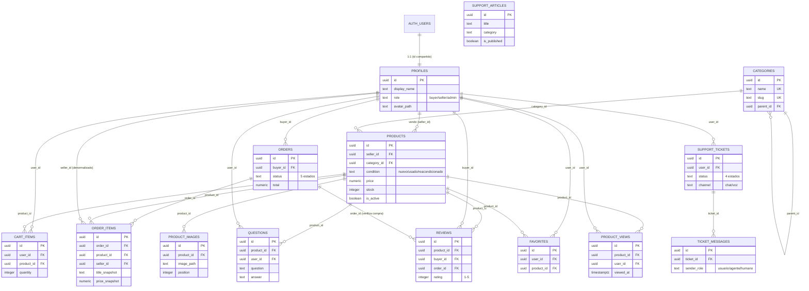

# Arquitectura de MercadoTech

Documento técnico de la arquitectura real del proyecto, sesiones 2 a 7.
Las secciones 1–8 documentan la infraestructura de datos construida en la
Sesión 2 (`MercadoTech_sesion2.md`) — base de datos, RLS, Storage, seed y
validación —, y siguen siendo la fuente de verdad de esa capa. Las
secciones 9–13 suman lo que cada sesión posterior agregó encima: frontend
(3), IA/RAG (4), Skills + MCP (5), testing/CI (6) y despliegue (7). Donde
el código actual difiere de lo que describe alguna spec de sesión, este
documento describe el código real, con una nota — nunca el plan original
sin verificar.

---

## 1. Arquitectura general y capas

MercadoTech separa el código en capas con una única responsabilidad cada una
y un solo camino de datos: `hooks → services → Supabase (RLS)`. No existe una
API REST paralela — el `app/api/v1/` solo aloja lo que no puede correr en el
navegador (secretos de IA, service role, cookies de sesión).

```
┌─────────────────────────────────────────────────────────────────┐
│  components/        Presentación PURA. Reciben props, no hacen  │
│                      fetching, no conocen Supabase.              │
├─────────────────────────────────────────────────────────────────┤
│  hooks/              Estado de cliente. Llaman a services.       │
│                      Cero lógica de negocio propia.               │
├─────────────────────────────────────────────────────────────────┤
│  services/           Lógica de negocio. Cada función acepta un   │
│                      SupabaseClient INYECTABLE (default: cliente │
│                      de navegador) — hooks y Route Handlers       │
│                      comparten la misma lógica, y los tests la    │
│                      mockean sin red.                            │
├─────────────────────────────────────────────────────────────────┤
│  lib/supabase/       Clientes: client.ts (browser, anon),        │
│                      server.ts (cookies+RLS), middleware.ts       │
│                      (refresco de sesión), admin.ts (service      │
│                      role, BYPASEA RLS — solo servidor).          │
├─────────────────────────────────────────────────────────────────┤
│  lib/ai/ · lib/voice/   Únicos archivos que conocen la API del   │
│                         proveedor de IA / voz (sesiones 4 y 8).  │
├─────────────────────────────────────────────────────────────────┤
│  Supabase: Postgres + RLS + Storage + Auth                       │
└─────────────────────────────────────────────────────────────────┘
```

Reglas derivadas (ver `CLAUDE.md` para el detalle completo):

1. Un archivo, una responsabilidad.
2. Sin barrels — se importa el archivo específico.
3. La UI nunca importa `lib/ai/`, `lib/voice/` ni `lib/supabase/admin.ts`.
4. Todo tunable vive en `lib/constants/`, documentado.

---

## 2. Organización de carpetas

Estructura real del repositorio al cierre de la Sesión 7 (no la planeada —
la construida):

```
MercadoTech/
├── app/
│   ├── (auth)/                  # login, register — layout con panel de showcase (S3/S7)
│   ├── (shop)/                  # catálogo, producto, carrito, pedidos, asistente, soporte
│   ├── (seller)/                # panel del vendedor (productos, publicar, kanban de pedidos)
│   └── api/v1/                  # chat, reindex, búsqueda semántica — solo lo server-only
├── components/                  # presentación pura, por dominio (catalog/, cart/, chat/, seller/, ui/...)
├── hooks/                       # estado de cliente (useAuth, useCart, useChat, useProducts...)
├── services/                    # lógica de negocio, cliente Supabase inyectable
├── lib/
│   ├── supabase/
│   │   ├── client.ts             # browser, NEXT_PUBLIC_SUPABASE_ANON_KEY
│   │   ├── server.ts             # server, cookies, respeta RLS
│   │   ├── middleware.ts         # refresco de sesión (patrón @supabase/ssr)
│   │   └── admin.ts              # service role, BYPASEA RLS, solo servidor
│   ├── validators/               # validación framework-agnóstica
│   ├── constants/                # tunables documentados (roles, catálogo, IA, producto)
│   ├── ai/                       # Sesión 4 — únicos archivos que hablan con Hugging Face
│   ├── voice/                    # Sesión 8 (pendiente)
│   └── utils.ts                  # cn(), formatPrice()
├── types/                        # tipos de dominio + database.ts (generado)
├── supabase/
│   ├── migrations/                # 25 migraciones, fuente de verdad del esquema
│   ├── seed.sql                   # datos de LABORATORIO (usuarios de prueba, productos falsos)
│   ├── seed.prod.sql              # datos de PRODUCCIÓN (categorías + FAQ, sin usuarios/productos)
│   ├── tests/rls-validation.sql   # validación de políticas RLS
│   └── config.toml
├── mcp/                          # Sesión 5 — servidor MCP (proceso Node aparte), ver mcp/README.md
├── e2e/                          # Sesión 6 — specs y Page Objects de Playwright
├── scripts/                      # index-all.ts (indexación manual del RAG)
├── .claude/skills/                # Sesión 5+ — 7 Skills de gobernanza, ver §11
├── .github/workflows/ci.yml       # Sesión 6 — checks + e2e, requisito de merge desde la S7
├── middleware.ts                  # raíz, usa lib/supabase/middleware.ts
├── .env.example
├── CLAUDE.md
├── README.md                      # documentación de producto (Sesión 7)
└── docs/
    ├── ARQUITECTURA.md            # este documento
    ├── RAG.md                     # Sesión 4 — casos de prueba y calibración del RAG
    ├── DEBUGGING.md                # Sesión 6 — metodología y errores típicos
    ├── PERFORMANCE.md              # Sesión 7 — Core Web Vitals antes/después
    ├── DEPLOY.md                   # Sesión 7 — secretos, despliegue, rollback
    ├── BITACORA.md                 # registro acumulativo por sesión
    └── PLAN_CURSO.md               # el plan original de las 8 sesiones (histórico)
```

---

## 3. Modelo relacional

14 tablas en `public`, todas con RLS habilitado. `profiles` es 1:1 con
`auth.users` (mismo UUID, `on delete cascade`).



`support_articles` no tiene relaciones — es una base de conocimiento
independiente para el RAG de soporte de la Sesión 4.

### Migraciones (orden de dependencia, `supabase/migrations/`)

| # | Migración | Contenido |
|---|---|---|
| 1 | `enable_extensions` | `pgcrypto` (schema `extensions`) |
| 2 | `create_helper_functions` | `set_updated_at()` |
| 3 | `create_profiles` | tabla + trigger `handle_new_user` |
| 4 | `create_categories` | tabla, árbol autoreferenciado |
| 5 | `create_products` | tabla + índices + trigger `updated_at` |
| 6 | `create_product_images` | tabla + índice |
| 7 | `create_cart_items` | tabla + unique compuesto |
| 8 | `create_orders` | tabla + índice |
| 9 | `create_order_items` | tabla + índices |
| 10 | `create_checkout_function` | `create_order_from_cart()` |
| 11–17 | `create_questions` … `create_ticket_messages` | resto de tablas |
| 18 | `rls_policies` | `is_admin()`, `order_has_seller_item()`, `order_belongs_to_buyer()`, 34 políticas, GRANTs |
| 19 | `storage_buckets` | buckets `product-images`/`avatars` + políticas |
| 20 | `handle_new_user_metadata` | Sesión 3 — trigger lee `role`/`display_name` de `raw_user_meta_data`, nunca acepta `'admin'` desde el registro |
| 21 | `enable_pgvector` | Sesión 4 — extensión `pgvector` |
| 22 | `create_knowledge_embeddings` | Sesión 4 — `vector(384)`, índice HNSW coseno |
| 23 | `create_match_knowledge` | Sesión 4 — RPC de búsqueda semántica |
| 24 | `knowledge_embeddings_rls` | Sesión 4 — `SELECT` solo `authenticated` |
| 25 | `grant_service_role` | Sesión 4 — fix de un gap heredado de la Fase 2.3: `service_role` no tenía GRANT de tabla; ver §5 |

Reconstruible desde cero con `supabase db reset` (migraciones + `seed.sql`
para desarrollo local; en producción, `seed.prod.sql` — ver
[`docs/DEPLOY.md`](./DEPLOY.md)).

---

## 4. Decisiones de diseño

**Snapshots en `order_items`.** `title_snapshot` y `price_snapshot` congelan
el título y precio del producto al momento de la compra. Si el vendedor edita
el producto después (o lo desactiva), el historial de pedidos del comprador
no cambia — es lo que vio y pagó, no lo que el producto es hoy.

**Checkout como función transaccional.** `create_order_from_cart(p_buyer_id)`
hace en una sola transacción: leer el carrito, bloquear cada producto con
`FOR UPDATE` (evita que dos checkouts concurrentes vendan el mismo stock dos
veces), crear la orden y los `order_items` con snapshots, descontar stock y
vaciar el carrito. Es `SECURITY DEFINER` con `search_path` fijo, sin GRANT a
`anon`/`public` y solo a `authenticated`; valida internamente
`p_buyer_id = auth.uid()` para que nadie haga checkout en nombre de otro. Al
ser la única vía de INSERT en `orders`/`order_items`, esas tablas no tienen
política de INSERT para el cliente — el bypass de RLS lo da la función, no un
permiso abierto.

**`seller_id` denormalizado en `order_items`.** Normalmente se llegaría al
vendedor vía `order_items.product_id → products.seller_id`, pero eso obliga a
las políticas RLS del vendedor a hacer join contra `products` en caliente.
Guardar `seller_id` directamente en `order_items` permite una política simple
(`seller_id = auth.uid()`) sin ese join — más rápida y más fácil de razonar.

**`product_views` como eventos, no contador.** Cada apertura de un producto
inserta una fila (`product_id`, `user_id`, `viewed_at`) en vez de incrementar
un contador en `products`. Esto preserva quién vio qué y cuándo — necesario
para analítica del vendedor y, más adelante, para recomendaciones — a costa
de más filas que un simple `view_count`.

**Roles vía `profiles.role`, no vía metadata del JWT.** El rol vive en una
columna de `profiles` (`buyer`/`seller`/`admin`), protegida por trigger para
que el propio usuario no se autopromueva. Se consulta desde `is_admin()`
(`SECURITY DEFINER`, bypasea RLS) para no repetir subconsultas a `profiles`
en cada política.

---

## 5. Row Level Security

Las 14 tablas tienen RLS habilitado desde su creación (Fase 2.2); las
políticas se agregaron en una migración dedicada (Fase 2.3), con
`(select auth.uid())` en vez de `auth.uid()` a secas para que el planner lo
evalúe una sola vez por consulta, no por fila.

### Funciones helper (`SECURITY DEFINER`, `search_path` fijo)

| Función | Uso |
|---|---|
| `is_admin()` | `role = 'admin'` del usuario actual, sin recursión sobre `profiles` |
| `order_has_seller_item(order_id, seller_id)` | ¿el vendedor tiene ítems en este pedido? |
| `order_belongs_to_buyer(order_id, buyer_id)` | ¿el pedido es de este comprador? |

Los dos últimos existen por un bug real que apareció al **correr** (no solo
leer) los tests de la Fase 2.6: las políticas de `orders` y `order_items` se
consultaban mutuamente en línea (`EXISTS (select ... from order_items ...)` y
viceversa), y cada consulta disparaba de nuevo la RLS de la otra tabla →
`infinite recursion detected in policy`. Envolver la consulta cruzada en una
función `SECURITY DEFINER` (que bypasea RLS puertas adentro, igual que
`is_admin()`) corta el ciclo. Queda documentado acá porque es un error opaco
y fácil de repetir en cualquier RLS con relaciones bidireccionales.

### Políticas por tabla

| Tabla | SELECT | INSERT | UPDATE | DELETE |
|---|---|---|---|---|
| profiles | dueño o admin | — (trigger `handle_new_user`) | dueño o admin; `role` protegido por trigger | — |
| categories | todos (anon incl.) | admin | admin | admin |
| products | activo, o dueño (ve sus inactivos) | seller autenticado, `seller_id = self` | dueño | dueño |
| product_images | visibilidad heredada del producto | dueño del producto | dueño del producto | dueño del producto |
| cart_items | dueño | dueño | dueño | dueño |
| orders | comprador, vendedor con ítems, o admin | — (solo `create_order_from_cart`) | vendedor avanza estado (no a `cancelado`) *o* comprador cancela si `pendiente` | — |
| order_items | comprador, vendedor de sus ítems, o admin | — (solo función) | — | — |
| questions | todos | autenticado, `user_id = self` | dueño del producto (responde) | autor o admin |
| reviews | todos | comprador con pedido `entregado` que contiene el producto (`EXISTS` sobre orders+order_items) | autor | autor o admin |
| favorites | dueño | dueño | — | dueño |
| product_views | vendedor del producto o admin | autenticado, `user_id = self` | — | — |
| support_articles | publicado, o admin (ve borradores) | admin | admin | admin |
| support_tickets | dueño o admin | dueño, `user_id = self` | dueño (solo a `cerrado`) o admin (cualquier estado) | — |
| ticket_messages | dueño del ticket o admin | dueño (`sender_role='usuario'`) o admin (cualquiera) | — | — |

**GRANTs de la Data API.** RLS decide qué filas; el GRANT decide si el rol
puede intentar el comando. Sin GRANT, Supabase devuelve "permission denied"
aunque la política sea correcta — lección explícita del plan del curso. `anon`
solo tiene `SELECT` sobre lo público (`categories`, `products`,
`product_images`, `questions`, `reviews`, `support_articles`); todo lo
privado (`cart_items`, `orders`, `order_items`, `profiles`, `favorites`,
`product_views`, `support_tickets`, `ticket_messages`) no tiene ningún GRANT
para `anon`.

### Storage

| Bucket | Lectura | Escritura/borrado |
|---|---|---|
| `product-images` | pública | vendedor autenticado, solo en `{seller_id}/{product_id}/...` propio |
| `avatars` | pública | cualquier autenticado, solo en `{user_id}/...` propio |

Política sobre `storage.objects` comparando `(storage.foldername(name))[1]`
(primer segmento del path) con `auth.uid()`. Límite 5 MB, MIME de imagen
(jpeg/png/webp/gif) por bucket.

---

## 6. Integración Next.js ↔ Supabase

Cuatro clientes en `lib/supabase/`, cada uno para un contexto de ejecución
distinto:

- **`client.ts`** — `createBrowserClient` de `@supabase/ssr`, usa la anon key.
  Es el único cliente seguro de importar desde Client Components.
- **`server.ts`** — `createServerClient` + `next/headers` (`cookies()`,
  async en Next 15). Respeta RLS igual que el cliente de browser; se usa en
  Server Components y Route Handlers para leer datos con la sesión del
  usuario ya resuelta desde las cookies.
- **`middleware.ts`** (en `lib/supabase/`) — `updateSession()`, el patrón
  oficial de `@supabase/ssr` para refrescar el token en cada request antes de
  que expire.
- **`admin.ts`** — cliente con `SUPABASE_SERVICE_ROLE_KEY`, **bypasea RLS por
  completo**. Exclusivamente server-only (Route Handlers, Server Actions,
  scripts); nunca se importa desde código que pueda llegar al navegador.

### Flujo de autenticación (middleware + cookies)

1. El `middleware.ts` de la raíz del proyecto corre en cada request que
   matchea (todo excepto assets estáticos) y delega en
   `lib/supabase/middleware.ts`.
2. `updateSession()` crea un `createServerClient` leyendo las cookies del
   request; si `NEXT_PUBLIC_SUPABASE_URL`/`ANON_KEY` no están configuradas
   (por ejemplo, en desarrollo antes de tener un proyecto Supabase), deja
   pasar el request sin tocar Auth en vez de tumbar la app con un 500 —
   comportamiento verificado manualmente al levantar `npm run dev` sin
   `.env.local` en la Fase 2.1.
3. `supabase.auth.getUser()` valida y refresca el token contra Supabase Auth;
   las cookies actualizadas se reescriben en la respuesta.
4. Los Server Components usan `lib/supabase/server.ts` para leer la sesión ya
   resuelta desde esas mismas cookies — sin round-trip adicional a Auth en
   cada componente.

---

## 7. Estrategia de escalabilidad

- **Índices** en todas las columnas de filtrado/join frecuente: FKs de alta
  cardinalidad (`seller_id`, `category_id`, `buyer_id`, `product_id` en las
  tablas de actividad) y `products.is_active` para el filtro por defecto del
  catálogo.
- **RLS con funciones `stable`/`SECURITY DEFINER`** en vez de subconsultas
  repetidas inline — el planner puede evaluarlas una vez por consulta en
  lugar de una vez por fila, y evita la recursión entre tablas relacionadas
  (ver §5).
- **Checkout serializado por fila, no por tabla.** El `FOR UPDATE` de
  `create_order_from_cart` bloquea únicamente las filas de `products`
  involucradas en ese carrito, no la tabla completa — los checkouts de
  productos distintos no se bloquean entre sí.
- **Storage desacoplado de Postgres.** Las imágenes viven en Storage
  (backend S3-compatible), no como BLOBs en la base — la base solo guarda
  el `image_path`.
- **Cliente inyectable en `services/`** (a partir de la Sesión 3): la misma
  función de negocio sirve tanto al hook de cliente (browser client) como al
  Route Handler (server/admin client), sin duplicar lógica ni forzar una capa
  REST intermedia.
- **`supabase gen types typescript`** mantiene los tipos de TypeScript
  sincronizados con el esquema real, evitando drift entre la base y el
  código a medida que el esquema crezca en sesiones futuras (pgvector en la
  Sesión 4, etc.).

---

## 8. Datos de prueba y validación

`supabase/seed.sql` siembra 6 usuarios (3 buyer, 2 seller, 1 admin —
contraseña `MercadoTech123!`), 8 categorías, 16 productos (2 inactivos, 1 con
stock 0), imágenes, 6 pedidos (uno por estado + un segundo `entregado`),
preguntas, reseñas, favoritos, eventos de vista, 10 artículos de soporte y 2
tickets con mensajes. Los `image_path` de `product_images` son rutas válidas
según la convención del bucket, pero **los archivos no existen en Storage**
hasta subirlos manualmente — documentado explícitamente en el propio seed.

`supabase/tests/rls-validation.sql` valida 9 escenarios (anónimo, comprador,
vendedor, admin, checkout) con 26 aserciones automáticas, cada una en su
propia transacción con `ROLLBACK` — no muta el seed. Se corre con
`docker exec -i <contenedor_postgres> psql -U postgres -d postgres -f
supabase/tests/rls-validation.sql` (el subcomando `supabase db query` no
soporta scripts multi-statement con `BEGIN`/bloques `DO`/`ROLLBACK`).

---

## 9. Frontend (Sesión 3)

UI completa sobre shadcn/ui, con una particularidad que condiciona cada
componente interactivo del proyecto: **este `shadcn/ui` corre sobre
`@base-ui/react`, no sobre Radix.** La composición polimórfica se hace con
la prop `render` (`<DialogTrigger render={<Button>Abrir</Button>} />`),
nunca con `asChild`. `<Select.Value />` tampoco resuelve la etiqueta sola:
necesita una función `children` que mapee `value → label` explícitamente —
un bug sistemático real de la Fase 3.8, repetido varias veces antes de
documentarse como convención (ver `CLAUDE.md`, "Convenciones de UI").

- **Layouts** por grupo de rutas: `(auth)`, `(shop)`, `(seller)` — cada uno
  con su propio navbar/sidebar, componentes puros sin fetching.
- **Drag & drop** con `@dnd-kit`: galería de imágenes del vendedor
  (`@dnd-kit/sortable`, reorden por índice) y kanban de pedidos
  (`@dnd-kit/core`, `KeyboardSensor` habilitado, movimiento por píxeles —
  ver §12 para el hallazgo real de cómo se testea esto en CI).
- **Snapshots, no precios en vivo.** Cualquier pantalla que muestre un
  pedido ya creado lee `order_items.price_snapshot`/`title_snapshot`
  (§4), nunca el precio actual del producto.

## 10. IA y RAG (Sesión 4)

Pipeline completo: búsqueda semántica en el catálogo, asistente de compras
(`/asistente`) y de soporte (`/soporte`, con base de FAQ). Detalle
completo, los 6 casos de prueba y la calibración de thresholds en
[`docs/RAG.md`](./RAG.md) — no se repite acá.

Dos decisiones de esta capa que vale tener presentes sin ir al documento
completo:

- **Dos mecanismos de Hugging Face, a propósito.** `lib/ai/embeddings.ts`
  usa el SDK (`InferenceClient.featureExtraction`); `lib/ai/completion.ts`
  usa `fetch` crudo al router OpenAI-compatible. No se unifican — mezclar
  ambos fue fuente de errores confusos en el proyecto de referencia.
- **`lib/ai/` es la única capa que conoce al proveedor.** La UI llega a la
  IA solo por `hook → fetch a /api/v1/* → service → lib/ai/` — verificado
  con un grep que debe dar vacío (`CLAUDE.md`, "Convenciones de IA").

## 11. Skills de gobernanza y servidor MCP (Sesión 5)

**El servidor MCP (`mcp/`) es de solo lectura** y reutiliza `services/` y
`lib/ai/` existentes — nunca reimplementa una consulta de negocio. Arma sus
propios clientes Supabase por llamada (nunca singleton), cliente `anon` por
defecto y `admin` solo donde la RLS real de la tabla lo exige. Detalle
completo de las 10 Tools, 7 Resources y 5 Prompts en
[`mcp/README.md`](../mcp/README.md).

**7 Skills en `.claude/skills/`**, cada una con un rol distinto — no
corren en la aplicación para el usuario final, son instrucciones que
Claude Code sigue en momentos específicos de construir y revisar el
código:

| Skill | Cuándo actúa | Qué audita |
|---|---|---|
| `mercadotech-architecture-enforcer` | ANTES de escribir código nuevo | Ubicación/capa (§1) |
| `mercadotech-code-reviewer` | DESPUÉS de escribir código | Calidad de dominio (RLS, snapshots, stock, pipeline RAG) |
| `mercadotech-automatic-validator` | Al cerrar una tarea/fase | Gate binario: enforcer + críticos del reviewer + lint + type-check + test + E2E |
| `mercadotech-tech-lead` | Decisiones de diseño/deuda técnica | Scorecard ponderado, no binario |
| `mercadotech-rag-auditor` | Al tocar `lib/ai/` | Trampas específicas de HF/pgvector ya documentadas en `docs/RAG.md` |
| `mercadotech-e2e-patterns` | Al escribir un test E2E | Patrones que ya rompieron CI (§12) |
| `mercadotech-rls-auditor` | Al escribir una migración nueva | RLS habilitada, políticas completas, reglas que no deberían vivir solo del lado cliente |

## 12. Testing y CI (Sesión 6)

Vitest (`services/`, `lib/`, mocks del cliente Supabase, sin red) +
Playwright (flujos E2E completos contra Supabase local real) + GitHub
Actions (`checks` + `e2e`, sin secretos — corre contra un stack de
Supabase efímero). Metodología de debugging y tabla de errores típicos
completa en [`docs/DEBUGGING.md`](./DEBUGGING.md).

Un hallazgo de esta capa que interactúa directo con §9: `playwright.config.ts`
fija `workers: 1` **siempre**, no solo en CI — los specs comparten filas
mutables del mismo seed entre archivos a propósito (el carrito de un mismo
comprador, un mismo pedido que dos specs mueven por el kanban), así que
solo son seguros corriendo en serie.

## 13. Despliegue (Sesión 7)

**URL de producción**: [mercadotech-one.vercel.app](https://mercadotech-one.vercel.app)

Vercel conectado al repositorio por su integración nativa de Git (sin CLI,
sin tokens de deploy en el workflow) sobre un proyecto Supabase hosted
separado del de desarrollo local, migrado con `supabase db push` y
sembrado con `supabase/seed.prod.sql` (catálogo vacío a propósito — nunca
el seed de laboratorio). `main` protegida: solo se actualiza por Pull
Request con `checks` y `e2e` en verde, sin excepción ni para push directo.
Gobernanza de secretos, flujo completo de despliegue, smoke test y plan de
rollback en [`docs/DEPLOY.md`](./DEPLOY.md); metodología y resultados de
performance (Core Web Vitals) en [`docs/PERFORMANCE.md`](./PERFORMANCE.md).
