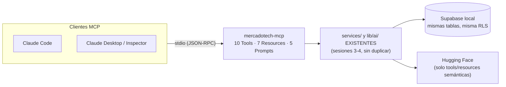

# mercadotech-mcp

Servidor MCP (*Model Context Protocol*) de MercadoTech: expone el catálogo,
la búsqueda semántica y el asistente de IA de la plataforma — de **solo
lectura** — a cualquier cliente MCP (Claude Code, Claude Desktop, el
Inspector, u otro), reutilizando los mismos `services/` y `lib/ai/` que ya
usa la web. Este servidor no tiene lógica de negocio propia: si algo no
existe como service, se documenta como derivación en `src/shared/`
(nunca una consulta de negocio nueva "porque era más corto").

## Qué es MCP, en una línea

Un protocolo estándar (JSON-RPC sobre stdio) para que un asistente de IA
use un sistema externo sin tocar su código. El cliente lanza este
servidor como proceso hijo y conversan por stdin/stdout.

## Arquitectura



```
mcp/src/
  index.ts        Entrada: redirige console.* a stderr, carga env, conecta stdio.
  server.ts        Metadata + orquesta el registro de tools/resources/prompts.
  env.ts           loadEnvLocal(): parsea .env.local de la RAÍZ (Node no lo hace solo).
  context.ts        createContext(): fábrica POR LLAMADA de clientes {anon, admin}.
  lib/
    tool-result.ts  Formato de salida de una tool (texto + JSON).
    errors.ts        NotFoundError / InvalidInputError / ProviderError.
    safe.ts          try/catch uniforme: toda tool/resource pasa por acá.
  tools/            10 tools, un archivo por tool + registro en index.ts.
  resources/        7 resources, ídem.
  prompts/          5 Prompts MCP, ídem.
  shared/           Derivaciones que componen services existentes
                    (no existen como service — documentado en cada archivo).
```

## Decisiones y su porqué

**Contexto por llamada, no al arrancar.** `context.ts` expone
`createContext()`, una FÁBRICA que cada tool/resource invoca DENTRO de su
propio handler — nunca un cliente creado una sola vez al iniciar el
proceso. El servidor puede quedar corriendo horas atendiendo un cliente
MCP; congelar credenciales/conexiones en un singleton es frágil para un
proceso de esa vida útil.

**stdout es sagrado.** Con transporte stdio, stdout transporta JSON-RPC:
un solo `console.log` en cualquier módulo importado (incluidos
`services/`/`lib/ai/`, escritos para la web donde esto era inofensivo)
corrompe la conexión. Por eso la primera línea real de `src/index.ts`
redirige `console.log/info/warn` a stderr, ANTES de importar nada más.

**Por qué NO importa `lib/supabase/client.ts` ni `lib/supabase/admin.ts`.**
`context.ts` construye sus dos clientes con `@supabase/supabase-js`
directo. `lib/supabase/client.ts` usa `createBrowserClient` de
`@supabase/ssr`, pensado para el navegador — no aplica bajo Node.
`lib/supabase/admin.ts` vive en el árbol de la app Next; el MCP es un
proceso Node aparte y arma su propio cliente admin con las mismas
credenciales de `.env.local`, igual que ya hace `scripts/index-all.ts`
(mismo patrón de `loadEnvLocal`, reutilizado tal cual — una sola fuente de
credenciales para toda la web y el MCP, sin `.env` propio en `mcp/`).

**anon vs. admin, por tool/resource, nunca "admin para todo".** Cada
registro documenta con un comentario por qué usa uno u otro. Regla: anon
por defecto; admin SOLO donde la RLS real de la tabla lo exige:

| Tabla | RLS | Por eso usan admin |
|---|---|---|
| `knowledge_embeddings` | `SELECT` solo `authenticated` | `semantic_search_products`, `ask_assistant`, `find_related_products` |
| `orders` / `order_items` | sin grant a `anon` | `get_order_status`, `get_store_stats` (top vendidos) |
| `profiles` | sin `SELECT` público (deuda de la Sesión 3, sin vista `public_profiles`) | resource `sellers/{sellerId}` |

**Reutilizar, no reimplementar.** Toda tool/resource llama a una función
de `services/` o `lib/ai/` existente, pasándole el cliente EXPLÍCITO
(nunca el default `= createClient()` de esos services, que apunta al
cliente de navegador). Cuando algo no existe como service — no había
`getProductsByIds`, ni agregados de categoría/ventas, ni un `getById` de
preguntas o artículos de FAQ — se DERIVA componiendo funciones existentes
en `src/shared/`, documentado en el comentario de cada archivo. Nunca se
agregó un service nuevo al proyecto web solo para el MCP.

**Ningún resource individual puede tumbar `resources/list`.**
`lib/safe.ts` envuelve cada handler; un resource que falla (ej. Supabase
caído) devuelve contenido de error en vez de lanzar una excepción sin
capturar. Verificado con `supabase stop`: `resources/list` sigue
respondiendo (el estático `mercadotech://info` y los dos templates con
`list: () => []`).

## Variables de entorno

Ninguna propia: reutiliza la `.env.local` de la RAÍZ del repo (mismo
archivo que usa la app Next). Requeridas: `NEXT_PUBLIC_SUPABASE_URL`,
`NEXT_PUBLIC_SUPABASE_ANON_KEY`, `SUPABASE_SERVICE_ROLE_KEY`. Opcional:
`HUGGINGFACEHUB_API_TOKEN` — sin él, las tools/resources semánticas
degradan con un error accionable en vez de tumbar el servidor.

## Comandos

Todos se corren **desde la raíz del repo** (no desde `mcp/`): el alias
`@/*` del tsconfig raíz resuelve a `./*`, y `env.ts` busca `.env.local` en
`process.cwd()`.

```bash
npx tsx mcp/src/index.ts        # dev, vía tsx (equivalente a `npm run dev` dentro de mcp/)
npm run build --prefix mcp       # produce mcp/dist/ con tsup
node mcp/dist/index.js           # producción, igual comportamiento que tsx
npm run type-check --prefix mcp  # tsc --noEmit
npx @modelcontextprotocol/inspector --cli npx tsx mcp/src/index.ts --method tools/list
```

## `.mcp.json`

En la raíz del repo, para que Claude Code descubra el servidor (pide
aprobarlo la primera vez — es el comportamiento esperado):

```json
{
  "mcpServers": {
    "mercadotech": {
      "command": "npx",
      "args": ["tsx", "mcp/src/index.ts"]
    }
  }
}
```

Variante de producción, tras `npm run build --prefix mcp`:

```json
{
  "mcpServers": {
    "mercadotech": {
      "command": "node",
      "args": ["mcp/dist/index.js"]
    }
  }
}
```

## Tools (10)

| # | Tool | Reutiliza | Cliente |
|---|---|---|---|
| 1 | `search_products` | `product.service.listActiveProducts` | anon |
| 2 | `get_product` | `shared/product-detail.ts` (getProductById + getProductImages + review.getAverage + question.listByProduct) | anon |
| 3 | `list_categories` | `shared/stats.getCategoryCounts` (deriva: `category.service.listCategories` + `product.service.listActiveProducts`) | anon |
| 4 | `semantic_search_products` | `vector-search.service.searchProducts` | admin |
| 5 | `ask_assistant` | `chat.service.ask` | admin |
| 6 | `compare_products` | `shared/products.hydrateProducts` (deriva: `getProductById` × N — no existe `getProductsByIds`) | anon |
| 7 | `find_related_products` | `lib/ai/embeddings` + `vector-search.service.searchByEmbedding` + `shared/products.hydrateProducts` | admin |
| 8 | `summarize_reviews` | `review.service.listByProduct` + `lib/ai/completion.generateCompletion` (prompt `REVIEW_SUMMARY_SYSTEM_INSTRUCTIONS` en `lib/ai/prompts.ts`) | anon |
| 9 | `get_store_stats` | `shared/stats.getStoreStats` (deriva: categorías/precios vía services + top vendidos vía `order_items`) | anon + admin |
| 10 | `get_order_status` | `order.service.getOrderById` (expone solo estado/fecha/total/items, nunca el comprador) | admin |

## Resources (7)

| URI | Contenido | Cliente |
|---|---|---|
| `mercadotech://info` | Descripción de la plataforma. Estático. | — |
| `mercadotech://products` | Resumen del catálogo activo. | anon |
| `mercadotech://products/{id}` | Detalle (template, misma función que la tool #2). | anon |
| `mercadotech://categories` | Categorías con conteo (misma derivación que #3). | anon |
| `mercadotech://sellers/{sellerId}` | Solo `display_name` + productos activos (template). | admin |
| `mercadotech://faq` | Artículos de soporte publicados. | anon |
| `mercadotech://stats` | Agregados (misma derivación que #9). | anon + admin |

## Prompts MCP (5)

**No son Skills de Claude Code** (esas viven en `.claude/skills/` y las
carga Claude Code; estos viven acá y los ofrece el protocolo). Cada uno
embebe contenido real como `resource` en el mensaje — nunca reimplementan
recuperación de datos.

| Prompt | Argumento(s) | Propósito |
|---|---|---|
| `describir_producto` | `productId` | Ficha atractiva y fiel (sin inventar specs/stock). |
| `comparar_productos` | `ids` (2-4, separados por coma — los argumentos de Prompt viajan como texto por protocolo) | Tabla comparativa + recomendación por perfil de uso. |
| `redactar_respuesta_pregunta` | `questionId` | Borrador de respuesta para el vendedor. |
| `resumen_de_resenas` | `productId` | Pros/contras; embebe reseñas crudas (distinto de la tool `summarize_reviews`, que ya devuelve el resumen hecho por el LLM del servidor). |
| `generar_articulo_faq` | `tema` | Borrador de artículo nuevo, con el estilo de los publicados. |

## Restricciones (vigentes en todo el servidor)

- Solo lectura: ninguna tool muta datos de la plataforma.
- Nada de datos privados: ni carritos, ni tickets ajenos, ni emails, ni
  teléfonos, ni nombres de compradores. `get_order_status` expone
  únicamente estado/fecha/total/ítems — en producción exigiría verificar
  que quien pregunta es el dueño del pedido (no hay sesión de usuario en
  el protocolo MCP tal como está, documentado como limitación).
